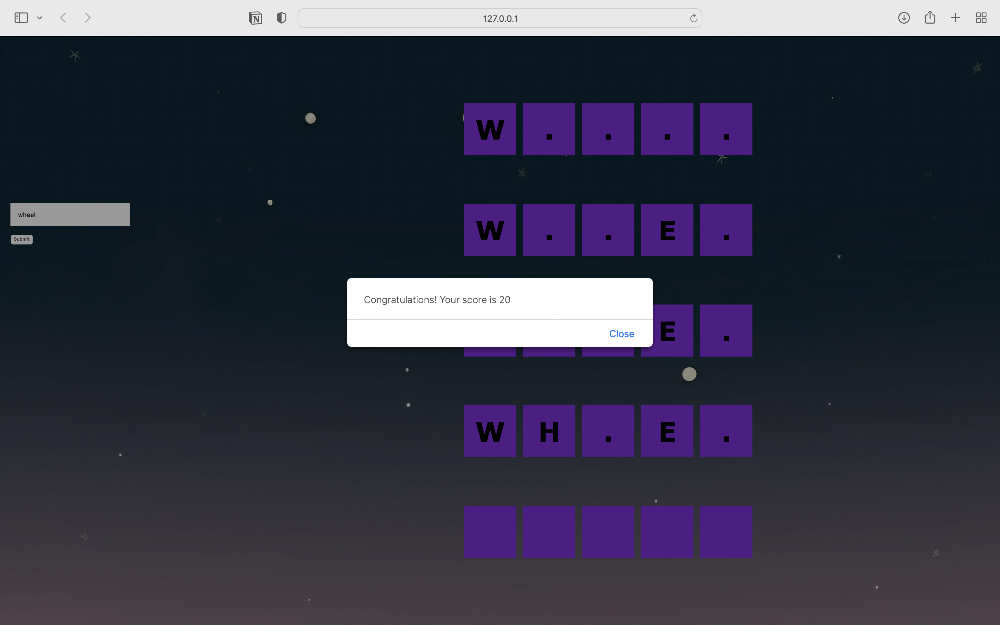

## Description 
>a clone of the classic word guessing game Lingo

<div align="center">
    
</div>

## Gameplay
The game presents a 5x5 grid where the player tries to guess a hidden 5-letter word. After each guess:

- Letters guessed in the correct position appear in the following row.
- Incorrect letters remain unchanged.

The player has a maximum of 5 attempts to guess the word correctly.

## Code Snippets

### createBoard() -> creates 5x5 grid

```
const startRows = ["", "", "", "", ""]

const createBoard = () => {
    startRows.forEach((row, index) => {
        rowElement = document.createElement("div")
        rowElement.classList.add("row")
        rowElement.id = "row" + index // Creates distinct names for row elements by adding suffix numbers
        createCells()
        gameBoard.append(rowElement)
    })
}

const createCells = () => {
    startRows.forEach((cell, index) => {
        const cellElement = document.createElement("span")
        cellElement.classList.add("cell")
        cellElement.id = index // Creates distinct id namess for cell elements
        rowElement.append(cellElement)
    })
}
```

### setAnswer() -> Chooses a random word from `data` array as an answer
````
const data = ["CHAIN", "AWARD", "JOINT", "PARTY", "WHEEL"]

// This function uses `Math.random()` to generate a random decimal number
// between 0 (inclusive) and 1 (exclusive). It then multiplies this number
// by `max` to get a value within the range [0, max)
function getRandomInt(max) {
    return Math.floor(Math.random() * max);
  }

const setAnswer = () => {
    answer = data[getRandomInt(5)].split("")
}
````

### setLetters() -> Populates the grid with individual letters from a word

````
const setLetters = (index) => {
    const row = document.getElementById("row" + String(index))
    const cells = row.getElementsByTagName("span")
        for(let i=0; i<cells.length; i++){
            if(isStart) {
                // Assigns the first letter of the answer to viewData
                viewData[0] = answer[0]
                isStart = !isStart
            }
            const letters = viewData
            cells[i].innerHTML = letters[i]
        }
        controlAnswer()
}
````
